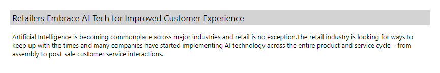

# react-word-section

This library gives developers other appropriate options of displaying a word section 
represented by a subject following the content of the text information in addition to simply displaying a subject on top of the text content.

This library gives 6 ways of displaying a section of text.  

### Common

The subject text is larger than the content text.

PC:

<p align="left">
  
</p>

Mobile:

<p align="left">
  
</p>

### Vertical Line

On top of the common style, a vertical line is added to the left of the subject text.

PC:

<p align="left">
  
</p>

Mobile:

<p align="left">
  
</p>

### Underline

On top of the common style, an underline is added to the bottom of the subject text.

PC:

<p align="left">
  
</p>

Mobile:

<p align="left">
  
</p>

### Background Color

On top of the common style, the subject text block has a background color.


PC:

<p align="left">
  
</p>

Mobile:

<p align="left">
  
</p>

### Bold

On top of the common style, the subject text is in bold.

PC:

<p align="left">
  
</p>

Mobile:

<p align="left">
  
</p>

### Block Corner Round

On top of the common style, a lightgrey background color is added to the text block that has the subject and the content, and the block corner becomes round.

PC:

<p align="left">
  
</p>

Mobile:

<p align="left">
  
</p>

## Installation

```
$ npm install --save react-word-section
```

## Usage

Here's a sample implementation that creates a word section on a dummy Create-React-App page.

```tsx
import React from 'react';
import WordSection from 'react-word-section';

function App() {
  const subject = 'Retailers Embrace AI Tech for Improved Customer Experience';
  const content = 'Artificial Intelligence is becoming commonplace across major industries and retail is no exception.The retail industry is looking for ways to keep up with the times and many companies have started implementing AI technology across the entire product and service cycle – from assembly to post-sale customer service interactions.';
  
  return (
    <>
      <WordSection 
        subject={subject}
        subjectStyle='common'
        background='white'
        corner='sharp'
      >
        {content}
      </WordSection>      
    </>
  );
}

export default App;
```

## Options

---

| Option                | Type       | Required   | Default                   | Description                                                |
| --------------------- | ---------- | ---------- | ------------------------- | ---------------------------------------------------------- |
| `subject`             | `String`   | Yes        | N/A                       | Subject text                                               |
| `subjectStyle`        | `String`   | No         | `common`                  | Subject text UI style.  `common`, `verticalLine`, `underline`, `backgroundColor`, or `bold`                     |
| `background`          | `String`   | No         | `white`                   | Background color of the section. `white` or `lightgrey`    |
| `corner`              | `String`   | No         | `sharp`                   | Corner appearance of the section block. `sharp` or `round` |

## Demo

[CodeSandbox](https://codesandbox.io/s/nifty-bassi-pr32j)
